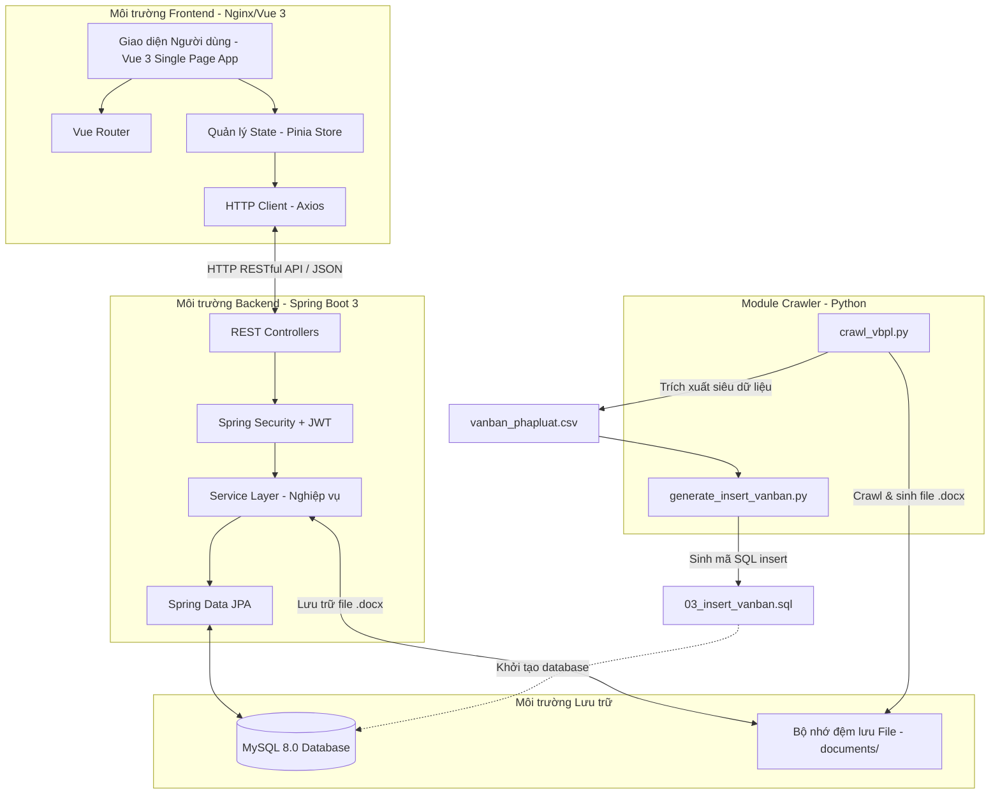

# BÁO CÁO CẤU TRÚC CHI TIẾT DỰ ÁN QUẢN LÝ TÀI LIỆU NỘI BỘ VÀ VĂN BẢN PHÁP LUẬT (QLTLNB)

Báo cáo này cung cấp thông tin toàn diện và chi tiết nhất về cấu trúc thư mục, kiến trúc hệ thống, công nghệ sử dụng, danh sách thư viện phụ thuộc (dependencies), thiết kế cơ sở dữ liệu và quy trình DevOps của dự án **Quản lý Tài liệu Nội bộ cho Công ty Luật Dân sự (QLTLNB)**.

---

## 1. Tổng Quan Kiến Trúc Hệ Thống

Dự án được xây dựng theo mô hình **Client-Server (3-Tier Architecture)** kết hợp với một **Module Crawler dữ liệu độc lập**. Hệ thống được đóng gói và vận hành thông qua các container Docker.



---

## 2. Cấu Trúc Thư Mục Toàn Dự Án

Dưới đây là cây thư mục tổng quan của project:

```text
Project/
├── backend/                  # Mã nguồn ứng dụng Backend (Java Spring Boot)
│   ├── .mvn/                 # Cấu hình Maven Wrapper
│   ├── src/                  # Thư mục chứa mã nguồn Java & Tài nguyên
│   │   └── main/
│   │       ├── java/com/qltnb/       # Package gốc ứng dụng
│   │       └── resources/            # Các cấu hình của ứng dụng (properties)
│   ├── Dockerfile            # Hướng dẫn đóng gói ứng dụng backend
│   ├── mvnw                  # Maven wrapper script cho Linux
│   ├── mvnw.cmd              # Maven wrapper script cho Windows
│   └── pom.xml               # Quản lý thư viện backend (Maven dependencies)
├── crawler/                  # Module Python crawl văn bản pháp luật
│   ├── documents/            # Thư mục lưu trữ văn bản (.docx) đã crawl thành công
│   ├── crawl_vbpl.py         # Script crawl chính từ thuvienphapluat/vbpl
│   ├── generate_insert_vanban.py  # Script đọc file CSV sinh dữ liệu SQL
│   ├── loi_crawl.txt         # File nhật ký ghi lỗi phát sinh trong quá trình crawl
│   ├── requirements.txt      # Danh sách thư viện Python cần thiết
│   └── vanban_phapluat.csv   # File dữ liệu CSV trung gian chứa metadata văn bản
├── database/                 # Chứa các tập tin khởi tạo Cơ sở dữ liệu
│   ├── 01_create_schema.sql  # Định nghĩa cấu trúc bảng và ràng buộc
│   ├── 02_seed_fake_data.sql # Thêm dữ liệu giả lập mẫu ban đầu (seeding)
│   ├── 03_insert_vanban.sql  # Mã SQL chèn văn bản pháp luật (sinh từ Crawler)
│   ├── ERD.png               # Sơ đồ quan hệ thực thể (Entity Relationship Diagram)
│   └── sql.mwb               # File thiết kế MySQL Workbench
├── documents/                # Thư mục được mount dùng chung để lưu các file văn bản (.docx)
├── docker-compose.yaml       # Tệp cấu hình khởi động toàn bộ môi trường Docker
├── logo_web.jpg              # Logo hệ thống
└── .gitignore                # Khai báo các file không đưa lên Git kiểm soát phiên bản
```

---

## 3. Chi Tiết Thiết Kế Cơ Sở Dữ Liệu (Database Schema)

Cơ sở dữ liệu của hệ thống được thiết kế trên **MySQL 8.0** với tên database là `qltl_luat_dan_su`. Bảng mã mặc định là `utf8mb4_unicode_ci` để hỗ trợ tối đa tiếng Việt.

### 3.1 Bảng Quản trị Hệ thống & Người dùng

*   **`VAI_TRO` (Role)**: Định nghĩa quyền hạn người dùng trong hệ thống.
    *   *Trường khóa*: `VT_id` (INT, PK, Auto Increment), `VT_ten` (VARCHAR(100), Unique - VD: `ADMIN`, `TRUONG_PHONG`, `NHAN_VIEN`), `VT_moTa` (TEXT).
*   **`BO_PHAN` (Department)**: Quản lý các phòng ban nghiệp vụ của công ty luật.
    *   *Trường khóa*: `BP_id` (INT, PK, Auto Increment), `BP_ten` (VARCHAR(150), Unique - VD: `Phong Dan su`, `Phong Dat dai`), `BP_moTa` (TEXT).
*   **`TAI_KHOAN_NGUOI_DUNG` (User)**: Lưu trữ tài khoản cán bộ/nhân viên công ty luật.
    *   *Trường khóa*: `ND_id` (INT, PK, Auto Increment), `BP_id` (INT, FK -> `BO_PHAN`), `VT_id` (INT, FK -> `VAI_TRO`).
    *   *Thông tin*: `ND_hoTen` (TEXT), `ND_taiKhoan` (VARCHAR(100), Unique), `ND_matKhau` (TEXT - lưu Bcrypt Hash), `ND_email` (VARCHAR(150), Unique), `ND_soLanSai` (INT), `ND_trangThaiTK` (BOOLEAN), `ND_chuyenMon` (TEXT), `ND_chungChi` (TEXT).

### 3.2 Bảng Khách hàng & Vụ việc Pháp lý

*   **`KHACH_HANG` (Client)**: Thông tin các đối tác, khách hàng cần hỗ trợ pháp lý.
    *   *Trường khóa*: `KH_id` (INT, PK, Auto Increment), `KH_CCCD_MST` (VARCHAR(50), Unique - Số căn cước hoặc Mã số thuế).
    *   *Thông tin*: `KH_ten` (TEXT), `KH_loai` (TEXT - `CA_NHAN` / `TO_CHUC`), `KH_sdt` (TEXT), `KH_diaChi` (TEXT), `KH_email` (TEXT), `KH_ngayTao` (DATETIME).
*   **`VU_VIEC` (Case/Matter)**: Các vụ việc tranh chấp, tư vấn pháp lý được thụ lý.
    *   *Trường khóa*: `VV_id` (INT, PK, Auto Increment), `KH_id` (INT, FK -> `KHACH_HANG`), `ND_phuTrach_id` (INT, FK -> `TAI_KHOAN_NGUOI_DUNG`).
    *   *Thông tin*: `VV_ten` (VARCHAR(200), Unique), `VV_loai` (TEXT), `VV_trangThai` (TEXT - `MOI_TIEP_NHAN`, `DANG_XU_LY`, `DA_DONG`), `VV_ngayMo` (DATETIME), `VV_ngayDong` (DATETIME), `VV_ghiChu` (TEXT).

### 3.3 Bảng Danh mục & Tài liệu

*   **`DANH_MUC` (Category)**: Phân nhóm tài liệu hoặc lĩnh vực pháp luật (Dân sự, Đất đai,...).
    *   *Trường khóa*: `DM_id` (INT, PK, Auto Increment), `DM_ten` (VARCHAR(150), Unique).
*   **`LOAI_TAI_LIEU_PHAP_LY` (Document Type)**: Phân loại theo thể chế văn bản (Luật, Nghị định, Thông tư, Quyết định,...).
    *   *Trường khóa*: `LTLPL_id` (INT, PK, Auto Increment), `LTLPL_ten` (VARCHAR(150), Unique), `LTLPL_moTa` (TEXT).
*   **`TAI_LIEU` (Document)**: Bảng lõi chứa cả văn bản pháp luật đã crawl và tài liệu nội bộ do nhân viên tự tải lên.
    *   *Trường khóa*: `TL_id` (INT, PK, Auto Increment), `DM_id` (INT, FK -> `DANH_MUC`), `LTLPL_id` (INT, FK -> `LOAI_TAI_LIEU_PHAP_LY`), `VV_id` (INT, Nullable, FK -> `VU_VIEC`), `ND_nguoiTao_id` (INT, Nullable, FK -> `TAI_KHOAN_NGUOI_DUNG`).
    *   *Thông tin*: `TL_ten` (TEXT), `TL_duongDan` (TEXT), `TL_dinhDang` (TEXT - `.docx`, `.pdf`, etc.), `TL_dungLuong` (BIGINT), `TL_nguoiTao` (TEXT - chuỗi lưu tên hiển thị hoặc 'crawler'), `TL_ngayTao` (DATETIME), `TL_ngayBanHanh` (DATE), `TL_daXoa` (BOOLEAN), `TL_baoMat` (TEXT - `NOI_BO` / `CONG_KHAI`), `TL_ngayHetHan` (DATETIME), `TL_soHieu` (VARCHAR(100)).
    *   *Ràng buộc đặc biệt*: `uk_tl_so_hieu_ten` đảm bảo tính duy nhất của cặp (`TL_soHieu`, `TL_ten(255)`).

### 3.4 Bảng Phiên bản & Lịch sử & Quyền hạn

*   **`PHIEN_BAN_TAI_LIEU` (Document Version)**: Theo dõi lịch sử thay đổi của từng file tài liệu nội bộ.
    *   *Khóa ngoại*: `TL_id` (FK -> `TAI_LIEU`), `ND_update_id` (FK -> `TAI_KHOAN_NGUOI_DUNG`).
    *   *Thông tin*: Phiên bản (`maPhienBan`), kích cỡ (`kichCo`), định dạng (`dinhDang`), đường dẫn file lưu trữ riêng biệt của từng phiên bản (`duongDan`).
*   **`QUYEN_TRUY_CAP` (Access Permission) & `tai_lieu_quyen_moi`**: Quản lý phân quyền xem/sửa tài liệu cho từng người dùng hoặc bộ phận.
*   **`DUYET_TAI_LIEU` (Document Approval) & `duyet_tai_lieu_moi`**: Ghi nhận tiến trình phê duyệt tài liệu nội bộ trước khi ban hành chính thức.
*   **`LICH_SU_HOAT_DONG` (Activity Log) & `lich_su_hoat_dong_moi`**: Ghi log hoạt động của người dùng (Thêm, sửa, xóa, duyệt, import file) đi kèm địa chỉ IP và mốc thời gian để phục vụ kiểm toán bảo mật.
*   **`THONG_BAO` (Notification) & `thong_bao_moi`**: Quản lý thông báo trạng thái phê duyệt tài liệu hoặc phân công vụ việc gửi tới từng người dùng cụ thể.

---

## 4. Module Backend (Java 21 + Spring Boot 3.2.5)

Backend được tổ chức theo kiến trúc phân tầng chuẩn của Spring Boot với các package như sau:

### 4.1 Cấu trúc mã nguồn Java (`backend/src/main/java/com/qltnb/`)

1.  **`QltnbApplication.java`**: Class chính chứa hàm `main` khởi chạy toàn bộ Spring Boot context.
2.  **`config/`**: Cấu hình toàn cục cho hệ thống.
    *   `SecurityConfig.java`: Thiết lập bộ lọc bảo mật, cơ chế CORS, phân quyền các route (Ant Matchers) và đăng ký bộ lọc xác thực JWT.
    *   `DevSecurityConfig.java`: Cấu hình bổ sung dành riêng cho quá trình phát triển cục bộ.
    *   `GlobalExceptionHandler.java`: Bắt tập trung toàn bộ lỗi ngoại lệ (Exceptions) ném ra từ Controller để chuyển đổi thành cấu trúc JSON ApiResponse đồng bộ.
3.  **`security/`**: Xử lý logic nghiệp vụ bảo mật và xác thực JWT.
    *   `JwtTokenProvider.java`: Tạo chuỗi token JWT từ thông tin người dùng đăng nhập thành công và thực hiện giải mã (parse), xác minh tính hợp lệ của token nhận từ client.
    *   `JwtAuthenticationFilter.java`: Bộ lọc chặn trước mọi HTTP Request để bóc tách JWT từ Header `Authorization`, truy vấn thông tin User và đưa vào context bảo mật (`SecurityContextHolder`).
    *   `CustomUserDetails.java` & `CustomUserDetailsService.java`: Adapter tích hợp giữa dữ liệu bảng `TAI_KHOAN_NGUOI_DUNG` và Spring Security Core.
4.  **`entity/`**: Chứa 17 JPA Entities tương ứng với 17 bảng trong cơ sở dữ liệu MySQL. Các Entity sử dụng thư viện **Lombok** (`@Data`, `@Getter`, `@Setter`, `@Builder`, `@NoArgsConstructor`, `@AllArgsConstructor`) để loại bỏ code sinh boilerplate thừa.
5.  **`dto/`**: Data Transfer Objects - Định dạng cấu trúc dữ liệu gửi và nhận tại Controller:
    *   `ApiResponse.java`: Cấu trúc JSON chuẩn hóa chung cho mọi API trả về (`success`, `message`, `data`, `errors`, `timestamp`).
    *   `LoginRequest.java` & `LoginResponse.java`: Phục vụ đăng nhập.
    *   `DocumentRequest.java` / `DocumentResponse.java`, `CaseRequest`/`CaseResponse`, `ClientRequest`/`ClientResponse`, `PermissionRequest`/`PermissionResponse`.
    *   `GlobalSearchResponse.java`: Chứa kết quả tìm kiếm toàn cục đa bảng.
6.  **`repository/`**: Chứa các Interface kế thừa từ `JpaRepository` hỗ trợ thao tác nhanh gọn với Database. Một số Repository tùy biến thêm các câu truy vấn `@Query` (JPQL/SQL Native) để lọc tài liệu theo điều kiện động hoặc tìm kiếm nâng cao (VD: `TaiLieuRepository`, `NguoiDungRepository`).
7.  **`service/`**: Lớp xử lý nghiệp vụ chính (Business Logic).
    *   `AuthService.java`: Xử lý đăng nhập, so khớp mật khẩu bằng `PasswordEncoder`.
    *   `DocumentService.java`: Quản lý logic CRUD tài liệu, kiểm tra quyền hạn truy cập của người dùng đối với từng tệp tin cụ thể trước khi cho phép tải xuống hoặc chỉnh sửa.
    *   `VersionService.java`: Quản lý các phiên bản tài liệu nội bộ, tự động nâng mã phiên bản khi tệp được cập nhật mới.
    *   `FileStorageService.java`: Thực hiện ghi tệp tin tải lên vật lý vào phân vùng ổ cứng được chỉ định (`/app/documents`).
    *   `CaseService.java` & `ClientService.java`: Quản lý vụ việc pháp lý và thông tin khách hàng liên quan.
    *   `SearchService.java`: Xây dựng thuật toán tìm kiếm đa tiêu chí đối với văn bản pháp luật và hồ sơ nội bộ.
    *   `DocumentImportService.java` & `DocumentScanService.java`: Tự động quét hệ thống tệp và nạp siêu dữ liệu (metadata) từ Crawler vào cơ sở dữ liệu.
8.  **`controller/`**: Chứa các REST Controller tiếp nhận request từ Client Frontend và trả ra JSON:
    *   `AuthController.java` (Route: `/api/auth/*`): Đăng nhập.
    *   `DocumentController.java` (Route: `/api/documents/*`): CRUD tài liệu, upload/download file.
    *   `VersionController.java`: Lịch sử phiên bản.
    *   `CaseController.java` & `ClientController.java`: API xử lý vụ việc và khách hàng.
    *   `SearchController.java`: Tìm kiếm toàn diện.
    *   `LookupController.java`: Lấy thông tin nhanh danh mục phòng ban, vai trò để phục vụ Dropdown ở Frontend.
    *   `NotificationController.java` & `PermissionController.java`.

### 4.2 Thư viện phụ thuộc Backend (`pom.xml`)

| Tên Thư Viện / Dependency | Mục Đích Sử Dụng |
| :--- | :--- |
| **`spring-boot-starter-data-jpa`** | Kết nối CSDL thông qua ORM Hibernate, giúp đơn giản hóa các thao tác CRUD. |
| **`spring-boot-starter-web`** | Xây dựng RESTful API và chạy Web server nhúng Tomcat. |
| **`spring-boot-starter-security`** | Bảo mật hệ thống, hỗ trợ cấu hình phân quyền truy cập API. |
| **`mysql-connector-j`** | JDBC driver để kết nối Java với Cơ sở dữ liệu MySQL. |
| **`lombok` (1.18.36)** | Tự động sinh Getter, Setter, Constructors bằng annotations khi biên dịch. |
| **`jsoup` (1.17.2)** | Thư viện phân tích và bóc tách cấu trúc HTML (sử dụng khi cần parse nội dung web). |
| **`jjwt-api`, `jjwt-impl`, `jjwt-jackson` (0.11.5)** | Thư viện xử lý mã hóa, giải mã và tạo token JWT phục vụ đăng nhập không trạng thái (stateless). |
| **`spring-boot-starter-test`** | Cung cấp môi trường kiểm thử Unit Test & Integration Test (JUnit, Mockito). |

---

## 5. Module Frontend (Vue 3 + Vite)

Frontend của dự án là một ứng dụng Web dạng Single Page Application (SPA), xây dựng dựa trên phiên bản **Vue 3** thế hệ mới (sử dụng Composition API và `<script setup>`).

### 5.1 Cấu trúc mã nguồn Frontend (`frontend/src/`)

*   **`main.js`**: Điểm bắt đầu của ứng dụng, đăng ký Pinia, Vue Router và nạp CSS chính.
*   **`App.vue`**: Component gốc, hiển thị layout tương ứng với router.
*   **`index.css`**: Nhập TailwindCSS để thiết kế giao diện tiện lợi, nhanh chóng.
*   **`router/index.js`**:
    *   Khai báo danh sách định tuyến gồm các View chính: Đăng nhập (`LoginView`), Trang chủ quản trị (`DashboardView`), Danh sách tài liệu (`DocumentListView`), Chi tiết tài liệu (`DocumentDetailView`).
    *   Sử dụng **Navigation Guards** (`beforeEach`) để kiểm tra trạng thái đăng nhập. Nếu người dùng chưa có Token trong LocalStorage mà cố tình truy cập trang Dashboard sẽ tự động chuyển hướng về trang `/login`.
*   **`stores/auth.js`**:
    *   Sử dụng **Pinia** store để quản lý thông tin trạng thái tài khoản đang đăng nhập hiện tại và lưu trữ Token JWT.
    *   Đảm nhận vai trò xử lý Login/Logout trên giao diện, đính kèm Token JWT vào mọi Request API.
*   **`api/`**: Module đóng gói toàn bộ các hàm gọi HTTP Request bằng **Axios**:
    *   Được phân chia rõ ràng theo đối tượng: `auth.js`, `documents.js`, `versions.js`, `cases.js`, `clients.js`, `activityLogs.js`, `notifications.js`, `permissions.js`, `search.js`.
    *   Tự động chèn token JWT vào HTTP Header `Authorization: Bearer <Token>` để vượt qua chốt kiểm soát của Spring Security.
*   **`layouts/MainLayout.vue`**: Layout tổng quan chứa thanh điều hướng bên trái (Sidebar) để chuyển đổi nhanh giữa các phân hệ và thanh công cụ bên trên (Topbar) hiển thị thông báo, thông tin cá nhân.
*   **`views/`**:
    *   `LoginView.vue`: Giao diện đăng nhập bóng bẩy kèm kiểm tra dữ liệu đầu vào.
    *   `DashboardView.vue`: Trang tổng quan hiển thị biểu đồ thống kê số lượng tài liệu theo danh mục, các vụ việc đang thụ lý, và danh sách nhật ký hoạt động mới nhất.
    *   `documents/DocumentListView.vue`: Danh sách và bộ lọc tìm kiếm tài liệu tiên tiến. Hỗ trợ import văn bản pháp luật, phân loại, tìm kiếm theo số hiệu.
    *   `documents/DocumentDetailView.vue`: Trang xem chi tiết tài liệu, danh sách các phiên bản cũ, phân quyền truy cập cho nhân viên khác và gửi yêu cầu phê duyệt.
*   **`components/`**: Các thành phần giao diện tái sử dụng.
    *   `documents/DocumentModal.vue`: Popup thêm mới hoặc cập nhật thông tin tài liệu.
    *   `common/ConfirmModal.vue`: Popup xác nhận xóa hoặc duyệt tài liệu.
    *   `common/Pagination.vue`: Thanh phân trang danh sách.
    *   `common/StatusBadge.vue`: Nhãn hiển thị trạng thái tài liệu (Đã duyệt, Đang chờ, v.v.).
    *   `common/ApiErrorMessage.vue` & `common/LoadingSpinner.vue`.

### 5.2 Thư viện phụ thuộc Frontend (`package.json`)

| Tên Thư Viện / Dependency | Mục Đích Sử Dụng | Môi Trường |
| :--- | :--- | :--- |
| **`vue` (3.5.38)** | Khung phát triển Javascript chính của giao diện ứng dụng. | Production |
| **`vue-router` (4.6.4)** | Quản lý định tuyến trang, dẫn hướng URL trên SPA. | Production |
| **`pinia` (3.0.4)** | Thư viện quản lý State tập trung, lưu giữ thông tin phiên làm việc. | Dev |
| **`axios` (1.18.0)** | HTTP Client hỗ trợ gửi nhận yêu cầu REST API bất đồng bộ. | Dev |
| **`tailwindcss` (3.4.19)** | Tiện ích CSS giúp phát triển giao diện linh hoạt, đáp ứng (Responsive). | Dev |
| **`vite` (8.0.16)** | Build tool tốc độ cao hỗ trợ Hot Module Replacement (HMR). | Dev |
| **`@vitejs/plugin-vue`** | Plugin tích hợp Vue 3 vào trình đóng gói Vite. | Dev |
| **`autoprefixer` & `postcss`** | Tự động chèn các tiền tố CSS tương thích trình duyệt. | Dev |

---

## 6. Module Crawler (Python 3)

Module Crawler được viết bằng Python giúp tự động hóa quá trình thu thập văn bản pháp luật làm giàu cơ sở dữ liệu hệ thống mà không cần nhập liệu thủ công.

### 6.1 Các tập tin thành phần
*   **`crawl_vbpl.py`**:
    *   Gửi request tới nguồn dữ liệu văn bản pháp luật (như thuvienphapluat.vn) để parse thông tin.
    *   Sử dụng thư viện **BeautifulSoup4** để tách thông tin: Tên văn bản, số hiệu, ngày ban hành, lĩnh vực, loại văn bản.
    *   Sử dụng **python-docx** để định dạng nội dung văn bản và ghi trực tiếp thành các file Word dạng `.docx` lưu tại thư mục `./crawler/documents/`.
    *   Xuất danh sách siêu dữ liệu thu gọn ra file `vanban_phapluat.csv`.
*   **`generate_insert_vanban.py`**:
    *   Đọc nội dung từ file CSV `vanban_phapluat.csv` sinh ra ở bước trên.
    *   Khử trùng lặp danh mục (`DANH_MUC`) và loại văn bản (`LOAI_TAI_LIEU_PHAP_LY`).
    *   Bọc chuỗi ký tự an toàn chống tấn công SQL Injection bằng cách lọc các ký tự nháy đơn.
    *   Tự động sinh ra file mã lệnh SQL lớn `database/03_insert_vanban.sql` dùng cho việc tạo dữ liệu mẫu tự động.

### 6.2 Thư viện phụ thuộc Crawler (`requirements.txt`)

| Thư viện | Mục Đích Sử Dụng |
| :--- | :--- |
| **`requests` (>=2.31.0)** | Gửi yêu cầu HTTP GET/POST tải trang HTML từ server. |
| **`beautifulsoup4` (>=4.12.0)** | Phân tích cây cấu trúc DOM HTML giúp trích xuất các thẻ chứa nội dung. |
| **`lxml` (>=4.9.0)** | Engine parse XML/HTML tốc độ cao dùng kèm với BeautifulSoup. |
| **`python-docx` (>=1.1.0)** | Hỗ trợ lập trình tạo và định dạng văn bản Word (.docx) trực tiếp trên Python. |
| **`selenium` (>=4.21.0)** | Điều khiển trình duyệt web tự động để lấy dữ liệu từ các trang sử dụng nhiều JS (nếu có). |

---

## 7. Môi trường Đóng gói & Vận hành (Docker DevOps)

Dự án được cấu hình để khởi động dễ dàng chỉ bằng một lệnh duy nhất thông qua Docker Compose.

### 7.1 Docker Compose (`docker-compose.yaml`)
Tập tin này định nghĩa và liên kết 3 dịch vụ chính:
1.  **Dịch vụ `mysql`**:
    *   Sử dụng base image `mysql:8.0`.
    *   Thiết lập tên database `qltl_luat_dan_su` cùng tài khoản phát triển (`dev_user` / `dev_password`).
    *   Ánh xạ thư mục vật lý `./database` vào phân vùng `/docker-entrypoint-initdb.d` trong container. Nhờ đó, MySQL sẽ tự động chạy lần lượt các file SQL theo thứ tự chữ cái (`01_create_schema.sql` -> `02_seed_fake_data.sql` -> `03_insert_vanban.sql`) khi khởi tạo container lần đầu.
    *   Cấu hình cơ chế `healthcheck` để giám sát trạng thái cơ sở dữ liệu đã sẵn sàng kết nối hay chưa.
2.  **Dịch vụ `backend`**:
    *   Được xây dựng từ `backend/Dockerfile`.
    *   Chỉ khởi chạy khi cơ sở dữ liệu mysql đã ở trạng thái khỏe mạnh (`condition: service_healthy`).
    *   Nhận thông tin cấu hình kết nối database thông qua biến môi trường để đảm bảo tính linh hoạt, bảo mật.
    *   Ánh xạ thư mục lưu file `./documents` từ host vào `/app/documents` trong container để bảo toàn dữ liệu file ngay cả khi container bị hủy.
3.  **Dịch vụ `frontend`**:
    *   Được xây dựng từ `frontend/Dockerfile`.
    *   Phơi port `80` (HTTP) ra ngoài máy vật lý để người dùng truy cập giao diện.

### 7.2 Dockerfile Backend
Sử dụng phương pháp **Multi-stage build** để tối ưu hóa dung lượng ảnh đĩa (image size):
*   **Stage 1 (Build)**: Sử dụng image chứa Maven (`maven:3.9-eclipse-temurin-21`), copy file cấu hình và chạy lệnh build đóng gói ứng dụng `mvn clean package -DskipTests` tạo ra tệp `.jar`.
*   **Stage 2 (Runtime)**: Sử dụng JDK rút gọn chạy thực tế (`eclipse-temurin:21-jre-jammy`), sao chép tệp `.jar` từ Stage 1 sang và khai báo lệnh khởi chạy `java -jar app.jar`. Việc này giúp loại bỏ hoàn toàn bộ cài Maven và mã nguồn cồng kềnh khỏi sản phẩm đóng gói cuối cùng.

### 7.3 Dockerfile Frontend
Cũng áp dụng cơ chế **Multi-stage build**:
*   **Stage 1 (Build)**: Sử dụng Node.js (`node:20-alpine`) để tải các gói thư viện npm và chạy lệnh biên dịch tối ưu hóa giao diện (`npm run build`). Kết quả xuất ra thư mục tĩnh `/dist`.
*   **Stage 2 (Runtime)**: Sử dụng Web server **Nginx** (`nginx:stable-alpine`), sao chép toàn bộ tệp tĩnh từ thư mục `/dist` của Stage 1 vào thư mục phục vụ web của Nginx (`/usr/share/nginx/html`). Nginx sẽ đảm nhận phân phối các file HTML/JS/CSS này với hiệu năng rất cao.
